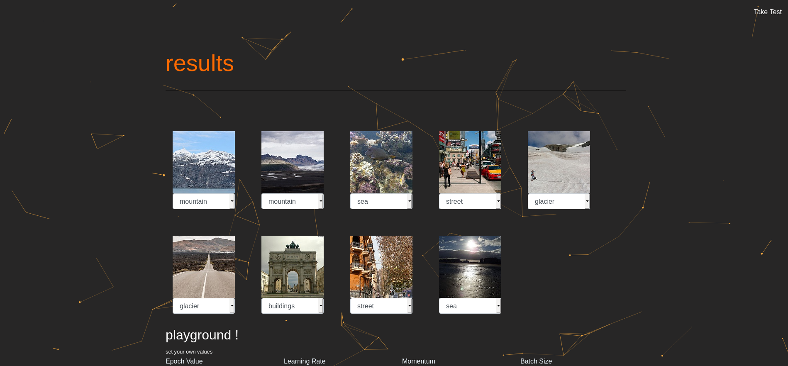
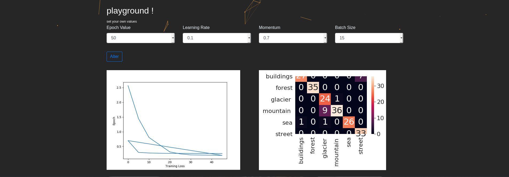

# mysterio

<p align="center">
A platform for training, labeling, deploying and retraining image classification model.

<br></br>

</p>


## Approach & Solution
-The trained model classifies images based on the dataset provided. 

-The UI can run inference using the model trained above on 128 unseen and unlabeled images uploaded at the same time.

-Once inference is completed, the UI is then able to visualize these images and their predictions including the confidence score and provide other metrics as appropriate.

-The UI should have the functionality to change the labels of images that are wrong, add them to a database and run training again.

-The UI have an option to change the parameters of training. Parameters could be learning rate, number of filters, filter size etc. 

-The newly trained model is available for use by the UI to run another round of inference.

<table align="center">
   <tr>
      <th></th>
      <th></th>
   </tr>
</table>

	
## Project Structure

    main.py :
        embedding the machine learning model to flask
        routing functions
    templates/ :
        frontend files
    static/ :
        media files
    model/ :
        pre-trained pickle file

## Dependencies

    Flask
    PyTorch
    Matplotlib

## Installation & Execution Guide

Clone the repository :
```
git clone https://github.com/deyRupak/mysterio.git
```
Install the dependencies :
```
pip install <dependency_name>
```
Change the directory :
```
cd mission_tasveer
```
Run main.py as:
```
py main.py
or
python main.py


- expected output
>py main.py
 * Serving Flask app "main" (lazy loading)
 * Environment: production
   WARNING: This is a development server. Do not use it in a production deployment.
 * Debug mode: on
 * Restarting with stat
 * Debugger is active!
 * Debugger PIN: 177-932-044
 * Running on http://127.0.0.1:5000/ (Press CTRL+C to quit)
```
Type in your browser [ will take you to the index page ]:
```
localhost:5000/
```
